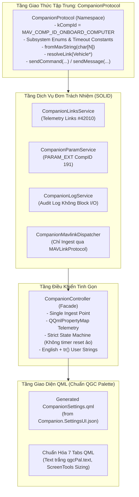

# THACO GROUND CONTROL — KẾ HOẠCH TÁI CẤU TRÚC TOÀN DIỆN (QGC REFACTOR PLAN)
## Tối Ưu Hóa Kiến Trúc, Khắc Phục Lỗi Nguy Hiểm, Đảm Bảo SOLID & Loại Bỏ Hardcode

> **Phân hệ:** `THACOGroundControl` (Trạm Mặt Đất GCS — C++20 / Qt6 / QML)  
> **Phương pháp tiếp cận:** Tối giản, loại bỏ over-engineering, YAGNI (**Ponytail**) kết hợp quy trình thực thi từng bước có kiểm thử chặt chẽ (**Writing Plans**).  
> **Mục tiêu cốt lõi:** Loại bỏ triệt để rủi ro mất an toàn bay — Sửa toàn bộ lỗi logic & race conditions — Tuân thủ chuẩn SOLID & QGC UI Design Rule.

---

## MỤC LỤC
1. [Báo Cáo Kiểm Toán Hiện Trạng & Danh Mục Vấn Đề (Audit Findings)](#1-báo-cáo-kiểm-toán-hiện-trạng--danh-mục-vấn-đề-audit-findings)
2. [Kiến Trúc Đích Tinh Gọn (Target Architecture — Ponytail & SOLID)](#2-kiến-trúc-đích-tinh-gọn-target-architecture--ponytail--solid)
3. [Lộ Trình Tái Cấu Trúc Chi Tiết (8 Tasks Tuần Tự)](#3-lộ-trình-tái-cấu-trúc-chi-tiết-8-tasks-tuần-tự)
4. [Quy Tắc Thiết Kế UI & Chuẩn Hóa QML](#4-quy-tắc-thiết-kế-ui--chuẩn-hóa-qml)
5. [Quy Trình Kiểm Thử & Tiêu Chí Nghiệm Thu (Definition of Done)](#5-quy-trình-kiểm-thử--tiêu-chí-nghiệm-thu-definition-of-done)

---

## 1. BÁO CÁO KIỂM TOÁN HIỆN TRẠNG & DANH MỤC VẤN ĐỀ (AUDIT FINDINGS)

Qua rà soát chuyên sâu toàn bộ mã nguồn `THACOGroundControl` (đặc biệt là phân hệ `custom/` và các can thiệp vào lõi QGC), hệ thống tồn tại 4 nhóm vấn đề lớn cần xử lý dứt điểm:

### 1.1. Nhóm 1: Các Lỗi Nghiêm Trọng (Critical Bugs)

| Mã | Tên Lỗi | Vị Trí Mã Nguồn | Phân Tích Kỹ Thuật & Hậu Quả |
| :---: | :--- | :--- | :--- |
| **C1** | **Xử lý nhân đôi MAVLink (Double Ingestion)** | `custom/src/CompanionController.cc:51, 182` | `CompanionController` vừa kết nối `MAVLinkProtocol::instance()->messageReceived` (bắt mọi byte trên link), vừa kết nối `Vehicle::mavlinkMessageReceived`. Khi có vehicle active, **mọi tin nhắn MAVLink bị xử lý 2 lần**: `STATUSTEXT` ghi log x2, ACK xử lý x2, XYZ trigger bắn signal x2. |
| **C2** | **Race Condition & Lệch State Machine khi Apply Config** | `custom/src/CompanionController.cc:574-696`, `CompanionTelemetryTab.qml:180-620` | `applyFcLink` gán `_configStatus = "Applying"` và bật timer 5s gọi `_configTimedOut`. Ngay sau đó gọi `applyConfig` ghi đè `_configStatus = "APPLYING"` (khác casing) và đặt `singleShot(3500)` tự reset về `"IDLE"`. Ở giây 3.5, UI bị reset sớm về `IDLE` trước khi ACK về. Khi timer 5s hết hạn, hàm `_configTimedOut()` kiểm tra `if (_configStatus != "Applying") return;` nên **không bao giờ khớp**, timeout bị tê liệt. |
| **C3** | **Lệnh Cấu Hình "Ma" (Phantom Config)** | `custom/src/CompanionController.cc:491-523` | `sendCameraConfig`, `sendVisionConfig`, `sendNetworkConfig` **không hề gửi bất kỳ gói tin MAVLink nào xuống máy bay**. Chúng chỉ gán biến local RAM QGC rồi hiện Toast thông báo "Staged". Khi người dùng nhấn nút Apply, GCS gửi `APPLY_CONFIG` xuống CC nhưng vì các giá trị mới chưa bao giờ được gửi qua `PARAM_EXT_SET`, CC chỉ reboot lại với **cấu hình cũ**. |
| **C4** | **UDP Hole-Punch Làm Hỏng Luồng MAVLink** | `src/Comms/UDPLink.cc:297-312` | Hàm `_sendHolePunch()` gửi 4 byte thô `{ '\xfd', '\x00', '\x00', '\x00' }`. Byte `0xFD` chính là `MAVLINK_STX_MAVLINK2`. Bất kỳ MAVLink router/parser nào trên drone (PX4, mavlink-router, CC) nhận được 4 byte này sẽ nhận diện là gói tin MAVLink 2 mới và lập tức báo lỗi **CRC/Parse error**, làm mất nhịp đồng bộ gói tin. |
| **C5** | **Blocking I/O Trên Luồng Giao Diện (UI Thread)** | `custom/src/CompanionLogService.cc:42-50` | `_flushLogEntryToFile()` gọi `_logStream.flush()` đồng bộ trực tiếp ra ổ đĩa trên mọi log MAVLink trong `logMavlink()`. Khi telemetry đổ về ở tần số cao, việc flush liên tục trên main thread gây giật lag khung hình QGC. |

---

### 1.2. Nhóm 2: Các Điểm Chưa Đảm Bảo Nguyên Tắc SOLID

* **S (Single Responsibility Principle — Trách nhiệm đơn nhất)**:
  - `CompanionController` là một "God Object" khổng lồ (~850 dòng C++, ~550 dòng header, ~80 `Q_PROPERTY`). Class này ôm đồm từ quản lý kết nối, giải mã telemetry, dispatching, format chuỗi, CLI emulator, watchdog, cấu hình UART đến Toast notification.
  - `CompanionLinksService` vừa làm nhiệm vụ nhận thống kê đường truyền, vừa kiêm nhiệm đóng gói và truyền tin cấu hình MAVLink.
* **O (Open/Closed Principle — Mở rộng / Đóng gói)**:
  - Toàn bộ cơ chế xử lý telemetry từ Companion Computer bị hardcode dạng `switch (message.msgid)` cho các case `42011, 42012, 42013, 42014, 32000` tại `CompanionController.cc:345`. Muốn bổ sung một subsystem (như LiDAR hay Cảm biến môi trường) buộc phải sửa ruột `CompanionController`.
  - Phân loại log `STATUSTEXT` dùng một chuỗi if-else dài kiểm tra tiền tố `"SIYI:"`, `"FC:"`, `"NET:"`, `"CAM:"`, `"SYS:"`, `"VIS:"`.
* **L & D (Liskov Substitution & Dependency Inversion)**:
  - Interface `ITelemetryHandler` được tạo ra nhưng không áp dụng đồng bộ cho Camera, Vision, Network, System mà chỉ dùng cho Links và Params.
  - Logic tìm kiếm link kết nối và gửi `COMMAND_LONG` bị sao chép 4 lần rải rác ở `CompanionController.cc` và `CompanionLinksService.cc` thay vì phụ thuộc vào một abstraction gửi tin chuẩn.
* **I (Interface Segregation Principle — Tách biệt giao diện)**:
  - Toàn bộ các Tab QML (`CompanionCameraTab`, `CompanionVisionTab`, `CompanionTelemetryTab`...) đều bị buộc phải phụ thuộc vào một singleton khổng lồ `CompanionController`.

---

### 1.3. Nhóm 3: Các Nguy Cơ Gây Nguy Hiểm Cho Máy Bay (Flight Safety Hazards)

```text
┌────────────────────────────────────────────────────────────────────────┐
│ CẢNH BÁO AN TOÀN BAY (FLIGHT SAFETY THREATS)                           │
│                                                                        │
│ 1. ĐIỀU KHIỂN ACTUATOR BẰNG CÁCH GHI FLASH PARAMETER:                 │
│    - AgriDroneController ghi setRawValue() vào Fact THACO_A*_DEF       │
│    - Làm mòn chip nhớ Flash/EEPROM của Cube Orange Plus khi bay        │
│    - Block luồng Parameter của PX4 Autopilot giữa chuyến bay          │
│                                                                        │
│ 2. TỰ Ý GÁN CỔNG VÀ BAUDRATE GIẢ ĐỊNH KHI APPLY LINK:                 │
│    - applyFcLink tự bịa siyiPort = "/dev/ttyAMA0", siyiBaud = 57600    │
│    - applySiyiLink tự bịa fcPort = "/dev/ttyAMA4", fcBaud = 921600     │
│    - Làm ghi đè mất kết nối với SIYI Remote hoặc Flight Controller     │
│                                                                        │
│ 3. FALLBACK MÙ QUÁNG TARGET SYSTEM = 1:                                │
│    - cmd.target_system = vehicle ? vehicle->id() : 1;                  │
│    - Khi vehicle null trong môi trường bay bầy đàn (Swarm, ID != 1),   │
│      lệnh cấu hình sẽ bắn nhầm vào máy bay khác                        │
│                                                                        │
│ 4. NUỐT LỖI MẤT KẾT NỐI (SILENT FAILURE):                              │
│    - saveDefaultConfig / restoreDefaultConfig return ngầm khi mất link │
│    - Phi công tưởng hệ thống đã lưu nhưng thực tế chưa gửi gì          │
└────────────────────────────────────────────────────────────────────────┘
```

1. **Điều khiển cơ cấu chấp hành (Actuator/Gripper) bằng cách ghi Parameter vào Flash (`AgriDroneController.cc:68-76`)**:
   - `AgriDroneController::setActuatorOn` thay đổi trạng thái bật/tắt thiết bị (`THACO_A1_DEF`..`THACO_A4_DEF`) thông qua `Fact::setRawValue()`.
   - Trong PX4, parameter được lưu vào chip nhớ Flash/EEPROM. Thay đổi liên tục khi bay sẽ làm mòn bộ nhớ và làm nghẽn luồng xử lý parameter của FC. Lệnh điều khiển chấp hành chuẩn MAVLink bắt buộc phải dùng `MAV_CMD_DO_SET_ACTUATOR` hoặc `MAV_CMD_DO_SET_SERVO`.
2. **Tự ý "bịa" cổng và baudrate dự phòng (`CompanionController.cc:553-611`)**:
   - Khi cấu hình UART, nếu telemetry từ CC chưa sync, code tự động gán fallback: `siyiPort = "/dev/ttyAMA0"`, `fcPort = "/dev/ttyAMA4"`. Nếu bay trên bo mạch khác (Jetson `/dev/ttyTHS*`), việc bấm lưu cổng này sẽ **vô tình ghi đè làm mất kết nối của cổng kia**, làm rớt link điều khiển giữa chuyến bay.
3. **Fallback mù quáng `target_system = 1` (`CompanionController.cc:644, 715, 762`)**:
   - Khi `vehicle` bị null, code tự gán `target_system = 1`. Trong môi trường bay nhiều drone (drone ID = 2, 3...), lệnh cấu hình hoặc reboot CC sẽ gửi nhầm sang drone khác.
4. **Nuốt lỗi khi mất kết nối (`CompanionController.cc:713, 760`)**:
   - Trong `saveDefaultConfig` và `restoreDefaultConfig`, nếu `!sharedLink`, hàm âm thầm `return;` mà không hiển thị thông báo lỗi trên UI, làm phi công tưởng rằng máy bay đã nhận lệnh.

---

### 1.4. Nhóm 4: Hardcode & Dead Code Tồn Đọng

1. **Đường dẫn tuyệt đối máy cá nhân trong production code (`CompanionParamService.cc:46`)**:
   ```cpp
   QFile localFile("/home/lnh/THACO_Drone/THACOGroundControl/custom/res/cc_parameters.json");
   ```
   Hardcode đường dẫn `/home/lnh/...` khiến ứng dụng fail khi chạy trên máy tính khác, CI/CD hoặc bản cài đặt chính thức.
2. **Magic Numbers rải rác**:
   - Message IDs: `32000` (XYZ Trigger), `253` (STATUSTEXT), `77` (COMMAND_ACK), `42010`–`42014` (CC Telemetry).
   - Command IDs: `44010` (SAVE_DEFAULT), `44011` (APPLY_CONFIG), `44012` (RESTORE_DEFAULT).
   - Component ID: `191` (thay vì `MAV_COMP_ID_ONBOARD_COMPUTER`).
   - Cổng serial & baudrate: `921600`, `57600`, `/dev/ttyTHS1`, `8554`.
3. **Dead QML Files & Hardcode IP/Port HTTP**:
   - `custom/qml/CompanionSettings.qml`: Chứa mã kiểm tra HTTP health check hardcode `192.168.10.1:8080`. Đây là **file chết** (giao diện thực tế được sinh từ `Companion.SettingsUI.json`), nhưng vẫn tồn tại và làm sai lệch unit test.
   - Các file QML rác khác: `CompanionUiAdapter.qml`, `CompanionConfigPanel.qml`, `CompanionConfigRow.qml`, `CompanionActionBar.qml`.
4. **Chuỗi giao diện lẫn lộn ngôn ngữ, thiếu `tr()`**:
   - `CompanionController.cc:560-610` dùng chuỗi tiếng Việt trần không qua `tr()` (`"Vui lòng chọn cổng cho Cube FC!"`, `"Xung đột cổng..."`) xen kẽ chuỗi tiếng Anh, phá vỡ hệ thống localization của QGC.
5. **Vi phạm chuẩn giao diện QGC UI Design Rule**:
   - `AgriDroneFlyViewDropPanel.qml:16` hardcode pixel literal `radius: 10`.
   - Các tab dùng màu hex tùy tiện thay vì Semantic Palette (`qgcPal.window`, `qgcPal.text`, `ScreenTools.defaultFontPointSize`).

---

## 2. KIẾN TRÚC ĐÍCH TINH GỌN (TARGET ARCHITECTURE — PONYTAIL & SOLID)

Áp dụng triệt để tinh thần **Ponytail** (cắt giảm tối đa mã nguồn thừa, không over-engineer, tận dụng triệt để thư viện chuẩn QGC/Qt):



### Các Quyết Định Kiến Trúc Then Chốt
1. **Một Cổng Ingest MAVLink Duy Nhất**: Chỉ subscribe `MAVLinkProtocol::instance()->messageReceived`. Loại bỏ `Vehicle::mavlinkMessageReceived` để xóa bỏ hoàn toàn lỗi Double Ingestion. Giúp trang cấu hình Companion hoạt động bình thường ngay cả khi FC đang tắt/mất nguồn (không có Vehicle).
2. **Một Điểm Gửi Lệnh Duy Nhất (`CompanionProtocol`)**: Toàn bộ logic tìm link kết nối (`resolveLink`) và đóng gói `COMMAND_LONG` được gom về `CompanionProtocol::sendCommand()`.
3. **Thay Thế 80 `Q_PROPERTY` Bằng `QQmlPropertyMap`**: Thay vì viết hàng trăm dòng getter/setter thủ công trong C++, map dữ liệu trực tiếp theo tên trường MAVLink chuẩn (`CompanionController.camera.video_width`), cắt giảm ~600 dòng boilerplate code.
4. **State Machine Chuẩn Xác Nhận Hai Pha (2-Phase Apply)**: Xóa bỏ timer 3.5s tự reset đè; trạng thái chỉ chuyển từ `Applying` sang `Success`/`Failed` khi nhận `COMMAND_ACK` hoặc timeout chính xác từ timer 5s / confirm timer 6s.
5. **Chuyển Đổi Actuator Sang MAVLink Command**: `AgriDroneController` chuyển từ việc ghi Flash Parameter sang gửi `MAV_CMD_DO_SET_ACTUATOR`, bảo vệ chip nhớ FC và an toàn bay.

---

## 3. LỘ TRÌNH TÁI CẤU TRÚC CHI TIẾT (8 TASKS TUẦN TỰ)

### 🎯 Task 1: Thiết Lập Thư Viện Giao Thức Tập Trung `CompanionProtocol`
- **Mục tiêu:** Xóa bỏ toàn bộ magic numbers, gom logic gửi lệnh MAVLink về một nơi duy nhất.
- **Tập tin tạo/sửa:**
  - Tạo: `custom/src/Companion/CompanionProtocol.h`
  - Tạo: `custom/src/Companion/CompanionProtocol.cc`
  - Tạo: `custom/test/CompanionProtocolTest.h`, `CompanionProtocolTest.cc`
  - Sửa: `custom/CMakeLists.txt` (bổ sung include path và đăng ký test)
  - Sửa: `custom/src/MAVLink/THACOMAVLink.h` (dùng alias an toàn cho `MAV_CMD_THACO_EXTERNAL_XYZ_ENUM`)
- **Nội dung kỹ thuật:**
  - Định nghĩa `kCompId = MAV_COMP_ID_ONBOARD_COMPUTER`.
  - Enum `Subsystem : int { All = 0, Telemetry = 1, Camera = 2, Network = 3, Vision = 4 }`.
  - Hàm an toàn `fromMavString(const char (&s)[N])` tự động cắt chuỗi đúng kích thước buffer.
  - Hàm `resolveLink(Vehicle* vehicle)`: Trả về primary link của vehicle; nếu vehicle null thì trả về link đầu tiên đang kết nối trong `LinkManager`.
  - Hàm `sendCommand(...)`: Gửi `COMMAND_LONG` thread-safe.
- **Tiêu chí nghiệm thu:** `CompanionProtocolTest` pass 100%.

---

### 🎯 Task 2: Chấm Dứt Double Ingestion & Tinh Gọn `CompanionController`
- **Mục tiêu:** Xóa bỏ lỗi nhân đôi tin nhắn, loại bỏ các hàm cấu hình "ma", chuẩn hóa State Machine.
- **Tập tin sửa đổi:** `custom/src/CompanionController.h`, `custom/src/CompanionController.cc`.
- **Nội dung kỹ thuật:**
  - Xóa bỏ kết nối `connect(_activeVehicle, &Vehicle::mavlinkMessageReceived...)`.
  - Thay thế toàn bộ magic numbers (`32000, 253, 77, 42010..42014, 44010..44012`) bằng enum chuẩn từ `thaco.h` và `CompanionProtocol.h`.
  - Xóa bỏ timer 3.5s tự reset đè trong `applyConfig()`.
  - Đồng bộ casing trạng thái: Sử dụng chuỗi trạng thái nhất quán (`Idle`, `Applying`, `WaitingTelemetry`, `Success`, `Failed`).
  - Chuyển `sendCameraConfig`, `sendVisionConfig`, `sendNetworkConfig` sang gọi lệnh `PARAM_EXT_SET` thật xuống CC thông qua `CompanionParamService` (`CC_CAM_*`, `CC_VIS_*`, `CC_AP_*`, `CC_ETH0_IP`).
  - Chuyển đổi toàn bộ chuỗi thông báo sang tiếng Anh có bọc `tr()`.
- **Tiêu chí nghiệm thu:** Gửi lệnh apply không bị reset sớm; log tin nhắn không bị lặp 2 lần; test `CompanionControllerTest` pass.

---

### 🎯 Task 3: Chuyển Đổi Actuator Sang MAVLink Command An Toàn Bay
- **Mục tiêu:** Ngăn chặn việc ghi Flash/EEPROM trên Flight Controller khi đang bay.
- **Tập tin sửa đổi:** `custom/src/AgriDroneController.h`, `custom/src/AgriDroneController.cc`, `custom/test/AgriDroneControllerTest.cc`.
- **Nội dung kỹ thuật:**
  - Thay thế `_actuatorFacts[actuatorIndex]->setRawValue(...)` bằng việc gửi `MAV_CMD_DO_SET_ACTUATOR` (hoặc `MAV_CMD_DO_SET_SERVO`).
  - Giữ lại `Fact` chỉ để đọc giá trị cấu hình ban đầu (nếu cần), không dùng Fact làm công tắc thời gian thực.
  - Sửa test `AgriDroneControllerTest` kiểm tra lệnh MAVLink command được gửi ra link an toàn.
- **Tiêu chí nghiệm thu:** Đóng ngắt gripper/actuator không làm tăng chu kỳ ghi Flash của FC; test `AgriDroneControllerTest` pass.

---

### 🎯 Task 4: Sửa Lỗi UDP Hole-Punch & Bảo Vệ Thread-Safe Trong `UDPLink`
- **Mục tiêu:** Chấm dứt việc phát tán 4 byte `0xFD` làm hỏng MAVLink parser.
- **Tập tin sửa đổi:** `src/Comms/UDPLink.h`, `src/Comms/UDPLink.cc`.
- **Nội dung kỹ thuật:**
  - Xóa bỏ mảng byte độc hại: `const char punchBytes[] = { '\xfd', '\x00', '\x00', '\x00' };`.
  - Thay thế bằng datagram rỗng kích thước 0-byte (chuẩn UDP hole-punching) hoặc một heartbeat packet hợp lệ nếu router yêu cầu payload.
  - Bổ sung `QMutexLocker` bảo vệ khi truy cập `_udpConfig->targetHosts()` từ worker thread, ngăn chặn data race với UI.
- **Tiêu chí nghiệm thu:** Wireshark bắt gói tin không còn byte `0xFD` rác; MAVLink router không còn ghi nhận lỗi parse CRC.

---

### 5. Task 5: Loại Bỏ Hardcode Tuyệt Đối & Tối Ưu I/O Trong Service Layer
- **Mục tiêu:** Xóa bỏ đường dẫn máy cá nhân `/home/lnh/...`, chống giật lag UI khi ghi log.
- **Tập tin sửa đổi:**
  - `custom/src/CompanionParamService.cc`
  - `custom/src/CompanionLogService.cc`
  - `custom/src/CompanionLinksService.cc`
- **Nội dung kỹ thuật:**
  - Xóa bỏ hoàn toàn dòng fallback `/home/lnh/THACO_Drone/...` trong `CompanionParamService.cc`. Chỉ load từ resource nhúng `":/custom/params/cc_parameters.json"`.
  - Trong `CompanionLogService.cc`: Xóa bỏ lệnh `_logStream.flush()` đồng bộ trong hàm `logMavlink()`. Gom buffer và chỉ flush định kỳ hoặc khi file đóng, chuyển việc ghi file sang luồng nền nếu cần.
  - Trong `CompanionLinksService.cc`: Thay thế toàn bộ `strncpy` bằng hàm an toàn `Companion::fromMavString`.
- **Tiêu chí nghiệm thu:** Ứng dụng chạy độc lập trên máy tính khác không bị lỗi thiếu file json; UI đạt 60 FPS khi telemetry gửi về liên tục.

---

### 🎯 Task 6: Tiêu Hủy Toàn Bộ Dead QML & Chuyển Sang `QQmlPropertyMap`
- **Mục tiêu:** Dọn sạch mã nguồn rác, xóa bỏ 80 `Q_PROPERTY` thủ công.
- **Tập tin xóa bỏ:**
  - `custom/qml/CompanionSettings.qml`
  - `custom/qml/CompanionActionBar.qml`
  - `custom/qml/CompanionConfigPanel.qml`
  - `custom/qml/CompanionConfigRow.qml`
  - `custom/qml/CompanionUiAdapter.qml`
- **Tập tin sửa đổi:**
  - `custom/custom.qrc` (xóa đăng ký các file dead QML)
  - `custom/CMakeLists.txt`
  - `custom/src/CompanionController.h`, `CompanionController.cc`
- **Nội dung kỹ thuật:**
  - Khai báo 5 `QQmlPropertyMap` đại diện cho 5 subsystem: `camera`, `vision`, `network`, `system`, `mission`.
  - Khi nhận telemetry từ MAVLink, ghi trực tiếp giá trị vào map bằng tên trường MAVLink (`camera.insert("video_width", cam.video_width)`).
  - Cập nhật test `CompanionControllerTest` trỏ vào trang sinh thực tế `qrc:/qml/QGroundControl/AppSettings/CompanionSettings.qml`.
- **Tiêu chí nghiệm thu:** Cắt giảm > 600 dòng code boilerplate trong C++; test load trang QML thành công không có cảnh báo undefined property.

---

### 🎯 Task 7: Đồng Bộ Giao Diện QML Theo Chuẩn QGC UI Design Rule
- **Mục tiêu:** Tuân thủ 100% tài liệu `QGC_UI_DESIGN_RULE.md`, xóa bỏ hoàn toàn màu hex và pixel cứng.
- **Tập tin sửa đổi:**
  - `custom/qml/CompanionOverviewTab.qml`
  - `custom/qml/CompanionTelemetryTab.qml`
  - `custom/qml/CompanionNetworkingTab.qml`
  - `custom/qml/CompanionCameraTab.qml`
  - `custom/qml/CompanionVisionTab.qml`
  - `custom/qml/CompanionMissionTab.qml`
  - `custom/qml/AgriDroneFlyViewDropPanel.qml`
- **Nội dung kỹ thuật:**
  - Xóa bỏ `radius: 10` cứng trong `AgriDroneFlyViewDropPanel.qml`, thay bằng `ScreenTools.defaultFontPixelWidth`.
  - Thay thế toàn bộ mã màu hex (`#1a1a1a`, `Qt.rgba(...)`) bằng `QGCPalette`:
    - Chữ hiển thị: Duy nhất `qgcPal.text` (trắng trong Dark Theme).
    - Nền panel: `qgcPal.windowShade`, `qgcPal.windowShadeDark`.
    - Trạng thái link: Dùng chữ "ONLINE" / "OFFLINE" rõ ràng, không dùng chấm tròn xanh/đỏ tùy tiện.
  - Sử dụng kích thước font chuẩn: `ScreenTools.defaultFontPointSize`, `ScreenTools.smallFontPointSize`, `ScreenTools.largeFontPointSize`.
- **Tiêu chí nghiệm thu:** `just lint` (qmllint) không còn bất kỳ cảnh báo styling nào.

---

### 🎯 Task 8: Kiểm Thử Toàn Diện & Đóng Gói Baseline
- **Mục tiêu:** Xác minh toàn bộ hệ thống hoạt động ổn định và đạt chuẩn Definition of Done.
- **Lệnh thực thi:**
  ```bash
  cd /home/lnh/THACO_Drone/THACOGroundControl
  just build
  just lint
  ctest --test-dir build -R "Companion|AgriDrone" --output-on-failure
  ```
- **Tiêu chí nghiệm thu:**
  - 100% test case Unit & Integration của Companion và AgriDrone PASS (tối thiểu 8 test suites: `CompanionProtocolTest`, `CompanionControllerTest`, `CompanionVehicleLifecycleTest`, `CompanionMavlinkDispatcherTest`, `CompanionLinksServiceTest`, `CompanionLogServiceTest`, `CompanionParamServiceTest`, `AgriDroneControllerTest`).
  - Pre-commit linters (`clang-format`, `qmllint`) đạt chuẩn sạch sẽ.

---

## 4. QUY TẮC THIẾT KẾ UI & CHUẨN HÓA QML

Mọi thành phần giao diện trong `THACOGroundControl` phải tuân thủ nghiêm ngặt các nguyên tắc sau:

```text
┌────────────────────────────────────────────────────────────────────────┐
│ BẢNG QUY TẮC THIẾT KẾ GIAO DIỆN QGC (QGC UI DESIGN TOKENS)            │
├────────────────────────┬───────────────────────────────────────────────┤
│ Thành Phần             │ Token Chuẩn Bắt Buộc Sử Dụng                 │
├────────────────────────┼───────────────────────────────────────────────┤
│ Nền tổng thể           │ qgcPal.window                                 │
│ Khung Card / Container │ qgcPal.windowShade                            │
│ Nền Input / Dropdown   │ qgcPal.windowShadeDark                        │
│ Màu chữ nội dung       │ qgcPal.text (KHÔNG gán màu cứng)             │
│ Nút bấm thao tác       │ QGCButton (Tự nhận diện hover/pressed)        │
│ Khoảng cách ngang      │ ScreenTools.defaultFontPixelWidth * 1.5       │
│ Khoảng cách dọc        │ ScreenTools.defaultFontPixelHeight * 0.5      │
│ Font chữ hiển thị      │ ScreenTools.defaultFontPointSize              │
│ Font chữ ghi chú       │ ScreenTools.smallFontPointSize                │
│ Font log kỹ thuật      │ ScreenTools.fixedFontFamily (Monospace)       │
└────────────────────────┴───────────────────────────────────────────────┘
```

---

## 5. QUY TRÌNH KIỂM THỬ & TIÊU CHÍ NGHIỆM THU (DEFINITION OF DONE)

Một nhiệm vụ refactor chỉ được coi là hoàn tất khi đáp ứng đầy đủ 4 tiêu chí sau:

1. **Biên dịch sạch sẽ (Clean Build):** Lệnh `just build` thực thi thành công 100%, không sinh thêm bất kỳ warning mới nào từ compiler C++20.
2. **Kiểm tra cú pháp & phong cách (Linting Clean):** Lệnh `just lint` (bao gồm `clang-format`, `qmllint`, `ruff`) vượt qua toàn bộ mà không vi phạm rules.
3. **Kiểm thử tự động thành công (All Tests Pass):** Toàn bộ bộ test suites của Companion và AgriDrone chạy qua `ctest` đều trả về kết quả `Passed`.
4. **Thông điệp Commit chuẩn mực:** Sử dụng quy chuẩn **Conventional Commits** (ví dụ: `fix(Companion): guard against double mavlink ingestion`, `refactor(Protocol): centralize constants into CompanionProtocol`).
